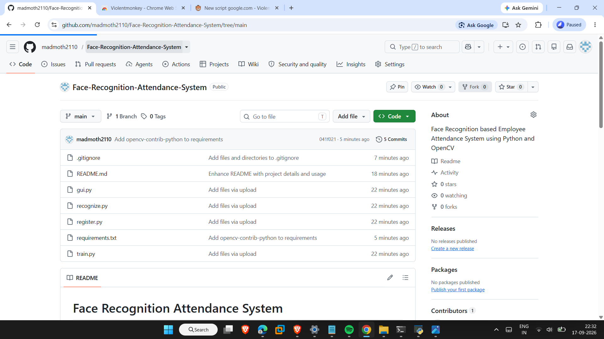

# Face Recognition Attendance System

A Python and OpenCV based Face Recognition Attendance System for employee registration, face recognition, and automatic attendance management.

## Features

* Register employees using webcam
* Train face recognition model
* Real-time face recognition
* Automatic attendance marking
* Save attendance with date and time
* View attendance through GUI
* Simple Tkinter GUI

## Technologies Used

* Python
* OpenCV
* Tkinter
* CSV
* LBPH Face Recognizer
* Haar Cascade Classifier

## Project Files

* `register.py` - Registers an employee face
* `train.py` - Trains the face recognition model
* `recognize.py` - Recognizes faces and marks attendance
* `gui.py` - Provides the graphical user interface

## How It Works

1. Register an employee using the webcam.
2. Train the face recognition model.
3. Start the camera.
4. The system recognizes registered faces.
5. Attendance is automatically recorded with date and time.
6. Attendance can be viewed through the GUI.

## How to Run

Install the required OpenCV package:

```
pip install opencv-contrib-python
```

Run the GUI:

```
python gui.py
```

## Note

This project is created for learning and demonstration purposes.

Real employee face images and attendance records should not be uploaded to a public repository because they contain personal data.
## Project Screenshot


